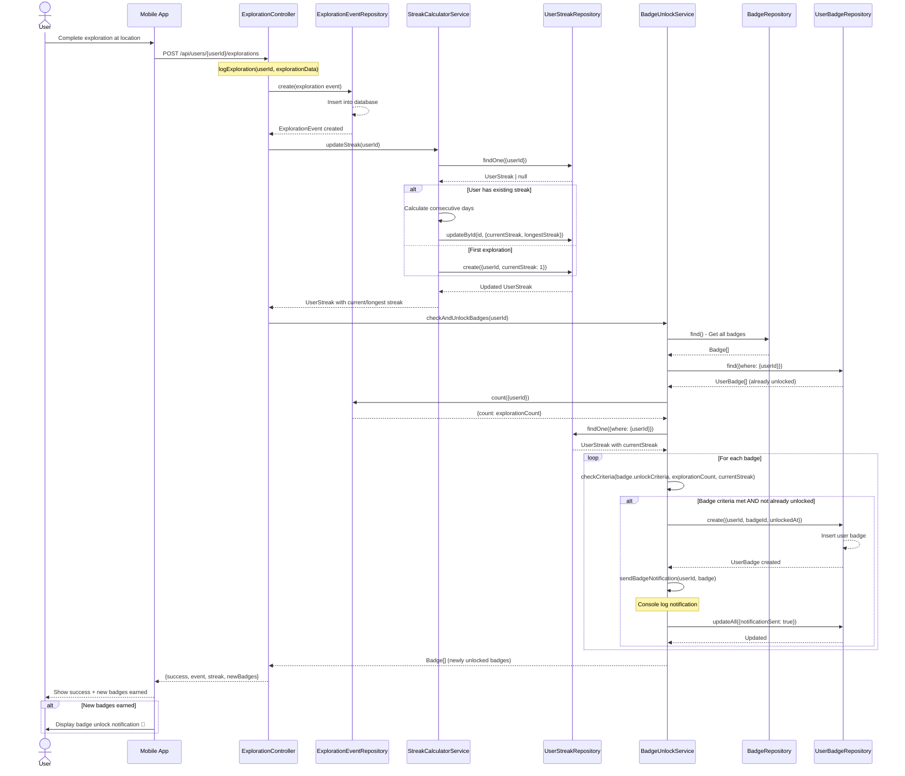
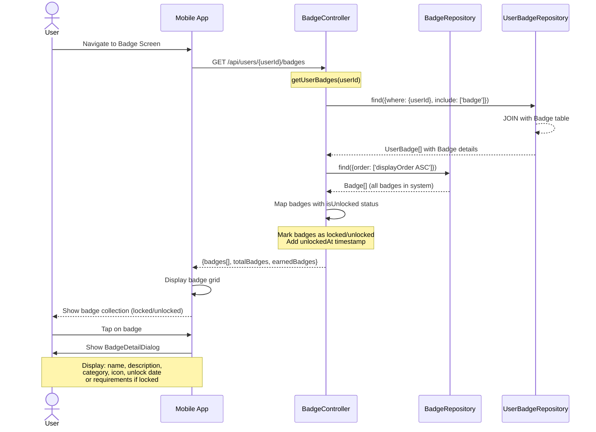

# Badge System Sequence Diagram

This sequence diagram illustrates the complete flow of badge earning, from logging an exploration to viewing badges in the UI.

## Main Flow: User Earns Badge Through Exploration

## Alternative Flow: User Views Badge Collection

## Key Interactions Summary

### 1. Exploration Logging Flow
- User completes exploration → App sends POST request
- System saves event → Updates streak → Checks badges
- Returns success with any newly unlocked badges
- Notifications are logged to console

### 2. Badge Checking Logic
- Retrieves all badges and user's unlocked badges
- Gets exploration count and current streak
- For each badge: checks if criteria met and not already unlocked
- Creates UserBadge entries for newly unlocked badges
- Logs notifications to console

### 3. Badge Viewing Flow
- App requests user's badges
- System retrieves all badges and marks unlock status
- Returns combined list with locked/unlocked indicators
- User can tap badges to view details

### 4. Badge Criteria Types
- **exploration_count**: Number of explorations completed
  - First Steps: 1, Explorer: 5, Adventurer: 10, Pathfinder: 25, World Traveler: 50, Legend: 100
- **streak**: Consecutive days with explorations
  - Daily Dedication: 3, Week Warrior: 7, Consistency King: 30

