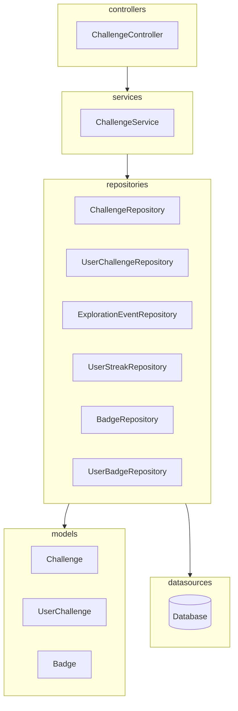

# Challenge Package Diagram

```mermaid
flowchart TB
    subgraph controllers
        ChallengeController
    end

    subgraph services
        ChallengeService
    end

    subgraph repositories
        ChallengeRepository
        UserChallengeRepository
        ExplorationEventRepository
        UserStreakRepository
        BadgeRepository
        UserBadgeRepository
    end

    subgraph models
        Challenge
        UserChallenge
        Badge
    end

    subgraph datasources
        DB[(Database)]
    end

    controllers --> services
    services --> repositories
    repositories --> models
    repositories --> datasources
```
