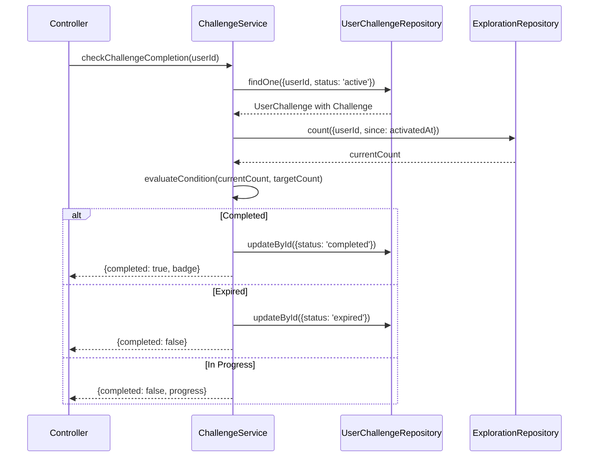

# Challenge Completion Sequence Diagram

This diagram shows the core challenge completion flow: `checkChallengeCompletion(userId)`

```mermaid
sequenceDiagram
    participant Controller
    participant ChallengeService
    participant UserChallengeRepository
    participant ExplorationRepository

    Controller->>ChallengeService: checkChallengeCompletion(userId)
    
    ChallengeService->>UserChallengeRepository: findOne({userId, status: 'active'})
    UserChallengeRepository-->>ChallengeService: UserChallenge with Challenge
    
    ChallengeService->>ExplorationRepository: count({userId, since: activatedAt})
    ExplorationRepository-->>ChallengeService: currentCount
    
    ChallengeService->>ChallengeService: evaluateCondition(currentCount, targetCount)
    
    alt Completed
        ChallengeService->>UserChallengeRepository: updateById({status: 'completed'})
        ChallengeService-->>Controller: {completed: true, badge}
    else Expired
        ChallengeService->>UserChallengeRepository: updateById({status: 'expired'})
        ChallengeService-->>Controller: {completed: false}
    else In Progress
        ChallengeService-->>Controller: {completed: false, progress}
    end
```
