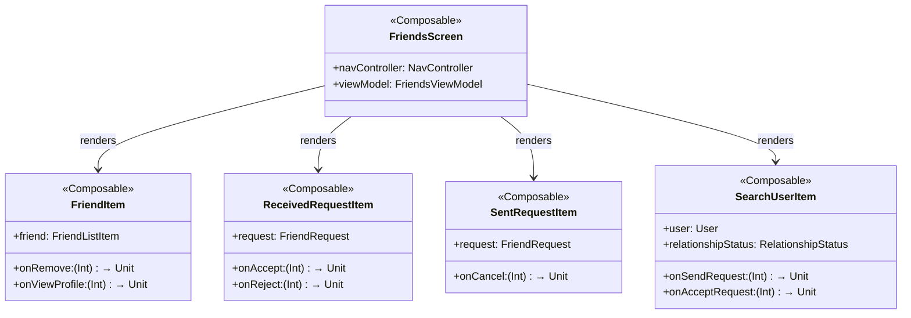
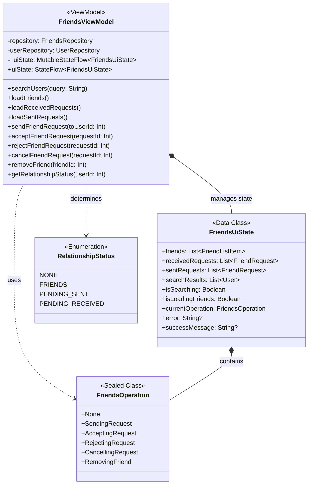
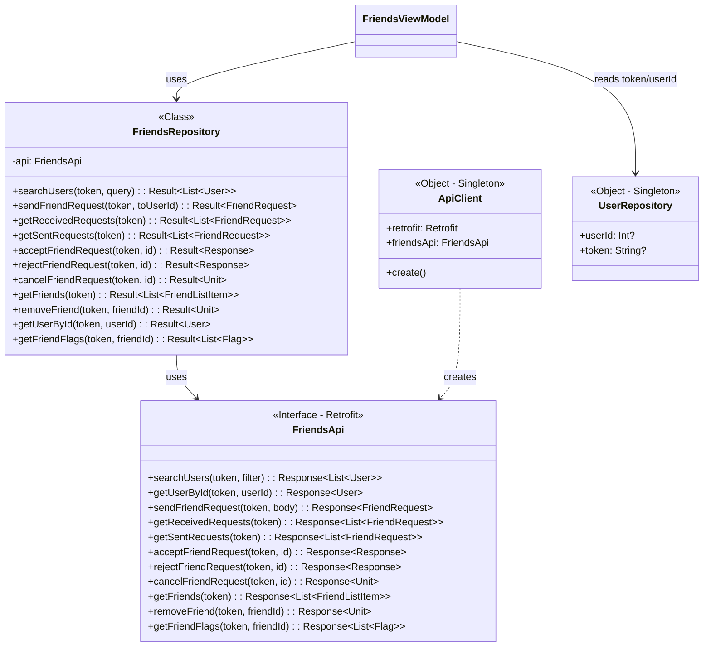
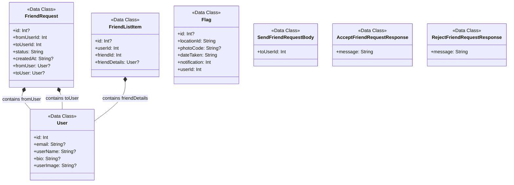

# Friends Feature - Frontend Class Diagrams

---

## Diagram 1: UI Components Layer

## Diagram 2: ViewModel & State Management

## Diagram 3: Data Layer - Repository & API

Shows data access layer components.

## Diagram 4: Data Models

