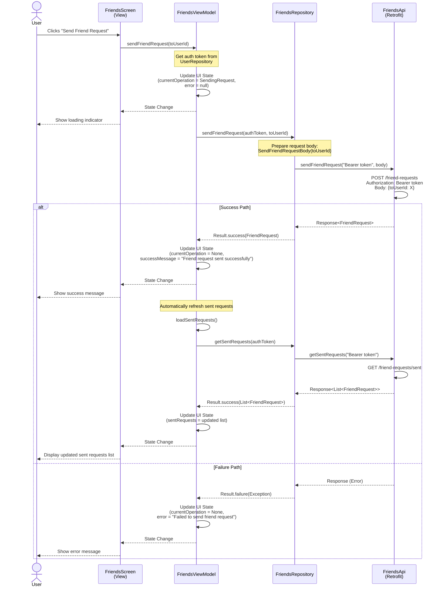

# Sequence Diagram: Send Friend Request

```mermaid
sequenceDiagram
    actor User
    participant UI as FriendsScreen<br/>(View)
    participant VM as FriendsViewModel
    participant Repo as FriendsRepository
    participant API as FriendsApi<br/>(Retrofit)

    User->>UI: Clicks "Send Friend Request"
    UI->>VM: sendFriendRequest(toUserId)

    Note over VM: Get auth token from<br/>UserRepository

    VM->>VM: Update UI State<br/>(currentOperation = SendingRequest,<br/>error = null)
    VM-->>UI: State Change
    UI-->>User: Show loading indicator

    VM->>Repo: sendFriendRequest(authToken, toUserId)
    Note over Repo: Prepare request body:<br/>SendFriendRequestBody(toUserId)

    Repo->>API: sendFriendRequest("Bearer token", body)
    API->>API: POST /friend-requests<br/>Authorization: Bearer token<br/>Body: {toUserId: X}

    alt Success Path
        API-->>Repo: Response<FriendRequest>
        Repo-->>VM: Result.success(FriendRequest)
        VM->>VM: Update UI State<br/>(currentOperation = None,<br/>successMessage = "Friend request sent successfully")
        VM-->>UI: State Change
        UI-->>User: Show success message

        Note over VM: Automatically refresh sent requests
        VM->>VM: loadSentRequests()
        VM->>Repo: getSentRequests(authToken)
        Repo->>API: getSentRequests("Bearer token")
        API->>API: GET /friend-requests/sent
        API-->>Repo: Response<List<FriendRequest>>
        Repo-->>VM: Result.success(List<FriendRequest>)
        VM->>VM: Update UI State<br/>(sentRequests = updated list)
        VM-->>UI: State Change
        UI-->>User: Display updated sent requests list

    else Failure Path
        API-->>Repo: Response (Error)
        Repo-->>VM: Result.failure(Exception)
        VM->>VM: Update UI State<br/>(currentOperation = None,<br/>error = "Failed to send friend request")
        VM-->>UI: State Change
        UI-->>User: Show error message
    end
```